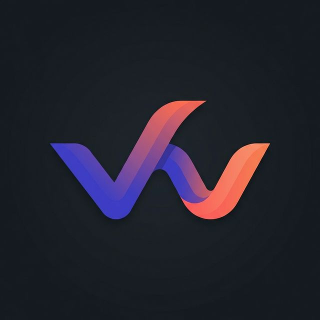

# 📱 TaskFlow Pro

> **Your intelligent task manager. Stay organized, boost productivity, and achieve more every day.**

[Features](#-features) • [Demo](#-demo) • [Installation](#-installation) • [Deployment](#-deployment) • [Contributing](#-contributing)

---

## ✨ Features

### 🎯 Core Functionality

- **Smart Task Management** — Create, edit, organize tasks with priorities, categories, and subtasks
- **Real-time Sync** — Your tasks sync instantly across all devices via Firebase Firestore
- **Offline-First** — Full functionality even without internet connection
- **Drag & Drop** — Intuitive task reordering with smooth animations

### 📅 Calendar Integration

- **Interactive Calendar** — Monthly view with task visualization
- **Date & Time Linking** — Set precise due dates and times for tasks
- **Real-time Clock** — Always know the current time in the header
- **Native Calendar Sync** (iOS/Android) — Add tasks to your device calendar

### 🔐 Authentication

- **Google Sign-In** — One-click authentication with your Google account
- **Email/Password** — Traditional sign-in option
- **Secure Sessions** — Firebase Authentication with automatic token refresh
- **Demo Mode** — Try the app without creating an account

### 💳 Subscription Tiers

- **Free** — Up to 10 tasks, basic features
- **Pro ($4.99/mo)** — Unlimited tasks, calendar integration, priority support
- **Premium ($9.99/mo)** — Everything in Pro + AI assistant, advanced analytics

### 🤖 AI Chatbot Assistant

- **Natural Language** — "Add meeting tomorrow at 3pm" → Creates task automatically
- **Daily Summaries** — Get overview of your tasks for today
- **Productivity Tips** — Personalized suggestions to improve your workflow
- **Motivational Support** — Encouraging messages to keep you on track

### 🎨 Beautiful Design

- **Dark/Light Mode** — Seamless theme switching
- **Glassmorphism UI** — Modern, premium aesthetic
- **Micro-animations** — Delightful interactions throughout
- **Responsive** — Perfect on desktop, tablet, and mobile

---

## 🚀 Demo

**Live Web App:** [https://taskflowpro.app](https://taskflowpro.app) *(replace with your deployment URL)*

**Download:**

- 📱 [iOS App Store](https://apps.apple.com/app/taskflow-pro) *(coming soon)*
- 🤖 [Google Play Store](https://play.google.com/store/apps/details?id=com.taskflowpro.app) *(coming soon)*

### Screenshots

Click to view screenshots

#### Login Page

#### Dashboard

#### Task Management

#### Calendar View

#### AI Chatbot

---

## 🛠️ Tech Stack

| Layer                 | Technology                                  |
| --------------------- | ------------------------------------------- |
| **Frontend**    | React 18 + Vite                             |
| **Styling**     | Vanilla CSS with CSS Variables              |
| **Icons**       | Lucide React                                |
| **Backend**     | Firebase (Auth, Firestore, Cloud Functions) |
| **Mobile**      | Capacitor (iOS & Android)                   |
| **Drag & Drop** | @hello-pangea/dnd                           |
| **Hosting**     | Firebase Hosting / Vercel                   |

---

## 📦 Installation

### Prerequisites

- **Node.js** 18+ and npm
- **Firebase account** (free tier works)
- **Xcode** (for iOS development, macOS only)
- **Android Studio** (for Android development)

### 1. Clone the Repository

\`\`\`bash
git clone https://github.com/yourusername/taskflow-pro.git
cd taskflow-pro
\`\`\`

### 2. Install Dependencies

\`\`\`bash
npm install
\`\`\`

### 3. Firebase Setup

1. **Create Firebase Project**

   - Go to [Firebase Console](https://console.firebase.google.com/)
   - Click "Add project" → Name it "TaskFlow Pro"
   - Enable Google Analytics (optional)
2. **Enable Services**

   - **Authentication**: Enable Google Sign-In provider
   - **Firestore Database**: Create database in production mode
   - **Cloud Messaging**: Enable for push notifications
3. **Get Configuration**

   - Go to Project Settings → General
   - Under "Your apps", click Web icon `</>`
   - Copy the `firebaseConfig` object
4. **Create Environment File**

\`\`\`bash
cp .env.example .env.local
\`\`\`

Edit `.env.local` and add your Firebase credentials:

\`\`\`env
VITE_FIREBASE_API_KEY=your_api_key_here
VITE_FIREBASE_AUTH_DOMAIN=your_project.firebaseapp.com
VITE_FIREBASE_PROJECT_ID=your_project_id
VITE_FIREBASE_STORAGE_BUCKET=your_project.appspot.com
VITE_FIREBASE_MESSAGING_SENDER_ID=your_sender_id
VITE_FIREBASE_APP_ID=your_app_id
VITE_FIREBASE_MEASUREMENT_ID=your_measurement_id
\`\`\`

5. **Deploy Firestore Security Rules**

\`\`\`bash
firebase deploy --only firestore:rules
\`\`\`

### 4. Run Development Server

\`\`\`bash
npm run dev
\`\`\`

Open [http://localhost:5173](http://localhost:5173) in your browser.

---

## 📱 Mobile App Setup

### Initialize Capacitor

\`\`\`bash

# Build the web app first

npm run build

# Initialize Capacitor (if not already done)

npx cap init

# Add iOS and Android platforms

npx cap add ios
npx cap add android
\`\`\`

### iOS Setup

1. **Prerequisites**

   - macOS with Xcode 14+ installed
   - Apple Developer Account ($99/year)
2. **Open in Xcode**
   \`\`\`bash
   npx cap open ios
   \`\`\`
3. **Configure Signing**

   - In Xcode, select the project
   - Go to "Signing & Capabilities"
   - Select your Team
   - Change Bundle Identifier if needed
4. **Add Firebase Config**

   - Download `GoogleService-Info.plist` from Firebase Console
   - Drag it into `ios/App/App/` in Xcode
5. **Build & Run**

   - Select a simulator or connected device
   - Click Run (⌘R)

### Android Setup

1. **Prerequisites**

   - Android Studio installed
   - Java JDK 11+ installed
2. **Open in Android Studio**
   \`\`\`bash
   npx cap open android
   \`\`\`
3. **Add Firebase Config**

   - Download `google-services.json` from Firebase Console
   - Place it in `android/app/`
4. **Build & Run**

   - Select an emulator or connected device
   - Click Run (▶️)

---

## 🚀 Deployment

### Web Deployment (Firebase Hosting)

\`\`\`bash

# Build for production

npm run build

# Deploy to Firebase Hosting

firebase deploy --only hosting
\`\`\`

### iOS App Store

1. **Prepare for Release**
   \`\`\`bash
   npm run build
   npx cap sync ios
   npx cap open ios
   \`\`\`
2. **Archive in Xcode**

   - Product → Archive
   - Upload to App Store Connect
3. **Submit for Review**

   - Go to [App Store Connect](https://appstoreconnect.apple.com/)
   - Fill in app information, screenshots, description
   - Submit for review

### Google Play Store

1. **Generate Signed APK/AAB**
   \`\`\`bash
   npm run build
   npx cap sync android
   npx cap open android
   \`\`\`
2. **Build Release**

   - Build → Generate Signed Bundle/APK
   - Create keystore or use existing
   - Build release AAB
3. **Upload to Play Console**

   - Go to [Google Play Console](https://play.google.com/console)
   - Create new app
   - Upload AAB and fill in store listing
   - Submit for review

---

## 🧪 Testing

### Run Unit Tests

\`\`\`bash
npm run test
\`\`\`

### Run E2E Tests

\`\`\`bash
npm run test:e2e
\`\`\`

### Test on Real Devices

- **iOS**: Use TestFlight for beta testing
- **Android**: Use Play Store Internal Testing

---

## 📚 Project Structure

\`\`\`
taskflow-pro/
├── public/                 # Static assets
│   └── logo.png           # App logo
├── src/
│   ├── components/        # Reusable UI components
│   │   └── Toast.jsx      # Toast notifications
│   ├── context/           # React Context providers
│   │   ├── AuthContext.jsx        # Authentication state
│   │   ├── TaskContext.jsx        # Task management
│   │   ├── SubscriptionContext.jsx # Subscription tiers
│   │   └── ThemeContext.jsx       # Dark/light mode
│   ├── pages/             # Page components
│   │   ├── LoginPage.jsx
│   │   ├── DashboardPage.jsx
│   │   ├── TasksPage.jsx
│   │   ├── CalendarPage.jsx
│   │   ├── ChatPage.jsx
│   │   └── SubscriptionPage.jsx
│   ├── utils/             # Utility functions
│   │   └── chatbot.js     # AI chatbot engine
│   ├── firebase.config.js # Firebase initialization
│   ├── index.css          # Global styles & design system
│   ├── App.jsx            # Main app component
│   └── main.jsx           # Entry point
├── ios/                   # iOS native project (Capacitor)
├── android/               # Android native project (Capacitor)
├── firestore.rules        # Firestore security rules
├── capacitor.config.ts    # Capacitor configuration
├── .env.example           # Environment variables template
└── package.json           # Dependencies
\`\`\`

---

## 🔒 Security

- **Firestore Rules**: User data is protected by security rules (see `firestore.rules`)
- **Authentication**: Firebase Auth handles secure token management
- **Environment Variables**: Sensitive keys stored in `.env.local` (not committed)
- **HTTPS Only**: All production traffic uses HTTPS

---

## 🤝 Contributing

Contributions are welcome! Please follow these steps:

1. Fork the repository
2. Create a feature branch (`git checkout -b feature/amazing-feature`)
3. Commit your changes (`git commit -m 'Add amazing feature'`)
4. Push to the branch (`git push origin feature/amazing-feature`)
5. Open a Pull Request

### Development Guidelines

- Follow the existing code style
- Write meaningful commit messages
- Add tests for new features
- Update documentation as needed

---

## 📄 License

This project is licensed under the **MIT License** - see the [LICENSE](LICENSE) file for details.

---

## 🙏 Acknowledgments

- **Icons**: [Lucide Icons](https://lucide.dev/)
- **Fonts**: [Google Fonts](https://fonts.google.com/) (Inter, Outfit)
- **Inspiration**: Modern productivity apps like Todoist, TickTick, and Notion

---

## 📞 Support

- **Email**: support@taskflowpro.app
- **Twitter**: [@TaskFlowPro](https://twitter.com/taskflowpro)
- **Discord**: [Join our community](https://discord.gg/taskflowpro)
- **Issues**: [GitHub Issues](https://github.com/yourusername/taskflow-pro/issues)

---

## 🗺️ Roadmap

- [ ] **v1.1** - Recurring tasks
- [ ] **v1.2** - Team collaboration features
- [ ] **v1.3** - Task templates
- [ ] **v1.4** - Integrations (Slack, Google Calendar, Notion)
- [ ] **v2.0** - Desktop apps (Electron)

---

**Made with ❤️ by Oshim Pathan**

⭐ Star this repo if you find it helpful!

